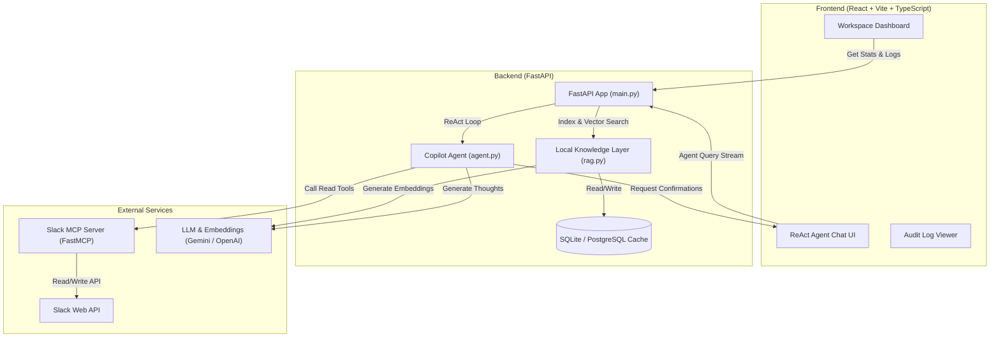

# Slack Intelligence Copilot 🚀

[](https://python.org)
[](https://nodejs.org)
[](https://vitejs.dev)
[](https://fastapi.tiangolo.com)
[](https://modelcontextprotocol.io)

An AI-driven workspace intelligence dashboard and conversational auditor for Slack. Slack Intelligence Copilot leverages the **Model Context Protocol (MCP)** to interact securely with Slack workspace data, caches conversations locally, generates vector embeddings, enables semantic search, and executes **ReAct-style reasoning loops** to summarize channels, track decisions, and draft posts with **human-in-the-loop validation**.

---

## 🏗️ System Architecture



---

## ✨ Core Capabilities

### 📊 Interactive Analytics Dashboard
* **Workspace Sentiment Tracking:** Real-time sentiment metrics calculated from message contexts to gauge team morale.
* **Activity & Engagement Trends:** Beautiful charts visualizing workspace message volume over time.
* **Automatic Action Item Extraction:** Detects and organizes pending tasks, assignments, and follow-ups.
* **Trending Topics Analysis:** Keyword frequency tracking to highlight what your team is discussing most.

### 🤖 ReAct-Style AI Copilot
* **Live Streaming Reasoning:** Streams the model's inner thoughts (Thoughts) and tool calls in real time to the Chat UI.
* **Intelligent Entity Resolution:** Automatically maps natural language references (e.g., `#general` or names like `Teja`) to precise Slack IDs.
* **Smart Synthesis Templates:** Generates executive-level channel summaries, key insights, action items, and risk logs.

### 🧠 Local Knowledge Layer (RAG)
* **High-Performance Caching:** Saves channel metadata, users, and message history to avoid Slack API rate-limiting.
* **Vector Embeddings & Semantic Search:** Generates cosine-similarity vector embeddings using Google Gemini (`text-embedding-004`) or OpenAI (`text-embedding-3-small`) with automatic SQLite full-text search fallback.
* **Dialect-Agnostic Database Adapter:** Supports seamless SQLite (development) and PostgreSQL (production) schemas with auto-translating queries.

### 🛡️ Secure Human-in-the-Loop & Auditing
* **Write Confirmations:** The agent suspends execution and requests manual confirmation in the UI before sending Slack messages or modifying workspace states.
* **API Diagnostics Panel:** Secure, masked credential configuration with built-in diagnostic tools to verify keys before storing them.
* **Immutable Audit Trail:** Log tracking for setting changes, synchronizations, agent actions, and authorization events.

---

## ⚙️ Prerequisites

Before you begin, ensure you have the following:

* **Python 3.10+**
* **Node.js 18+** & **npm**
* **Slack Bot User OAuth Token** (`xoxb-...`) containing scopes:
  * `channels:read`, `groups:read`, `channels:history`, `groups:history`, `users:read`, `chat:write`
* **Google Gemini API Key** (or **OpenAI API Key**) for model reasoning and embedding generation.

---

## 🚀 Local Development Setup

### 1. Backend Setup

1. Navigate to the backend directory:
   ```bash
   cd backend
   ```
2. Create and activate a Python virtual environment:
   * **Windows (PowerShell):**
     ```powershell
     python -m venv venv
     .\venv\Scripts\activate
     ```
   * **macOS/Linux:**
     ```bash
     python -m venv venv
     source venv/bin/activate
     ```
3. Install the required dependencies:
   ```bash
   pip install -r requirements.txt
   ```
4. Configure environment variables:
   * Copy the template file:
     ```bash
     cp .env.example .env
     ```
   * Open `.env` and fill in `SLACK_BOT_TOKEN`, `GEMINI_API_KEY` (or `OPENAI_API_KEY`), and set `DATABASE_URL` if using a remote database (otherwise, it defaults to a local SQLite database file `slack_copilot.db`).
5. Launch the FastAPI server:
   ```bash
   python main.py
   ```
   * The API server runs at `http://127.0.0.1:8000`.
   * FastMCP launches the Slack MCP server dynamically as a child process.

### 2. Frontend Setup

1. Navigate to the frontend directory:
   ```bash
   cd ../frontend
   ```
2. Install npm packages:
   ```bash
   npm install
   ```
3. Configure environment variables:
   * Copy the template file:
     ```bash
     cp .env.example .env
     ```
   * Verify that `VITE_API_BASE` points to your backend URL (defaults to `http://localhost:8000/api/v1`).
4. Start the Vite development server:
   ```bash
   npm run dev
   ```
   * Open `http://localhost:5173` in your browser to view the application.

---

## ☁️ Deployment Guidelines

Because the project is architected as decoupled services, the frontend and backend can be hosted independently.

### Backend Deployment (e.g., Render, Railway, Fly.io)

1. **Deploy Python Web Service:**
   * Root Directory: `backend/`
   * Build Command: `pip install -r requirements.txt`
   * Start Command: `uvicorn main:app --host 0.0.0.0 --port $PORT`
2. **Environment Variables:**
   * Ensure `SLACK_BOT_TOKEN`, `GEMINI_API_KEY` (or `OPENAI_API_KEY`), and `LLM_PROVIDER` are defined.
3. **Database Configuration:**
   * **SQLite (with persistent volume):** If using SQLite, mount a persistent disk (e.g., 1GB mounted at `/app/data/`) and update `DB_PATH` in your environment variables to point to the persistent disk path.
   * **PostgreSQL (e.g., Supabase):** Define the `DATABASE_URL` environment variable. The backend features automatic connection healing logic built specifically for the Supabase Transaction Pooler, including URL-decoding credentials and username formatting to prevent connection issues.

### Frontend Deployment (e.g., Vercel, Netlify, Cloudflare Pages)

1. **Deploy static Vite App:**
   * Root Directory: `frontend/`
   * Build Command: `npm run build`
   * Output Directory: `dist`
2. **Environment Variables:**
   * Configure `VITE_API_BASE` to point to your live backend API URL (e.g., `https://your-backend-api.com/api/v1`).

---

## 🔒 Security & Governance

* **Human-in-the-Loop Verification:** Any mutating operations, such as posting messages or thread replies, require explicit human confirmation in the dashboard interface before execution.
* **Safe Configuration Storage:** API keys and credentials can be securely entered and updated through a masked settings panel, validating credentials before persisting them safely in the database.
* **Immutable Logs:** Audit trail preserves records of workspace synchronization, credentials testing, and user approvals to ensure accountability.
