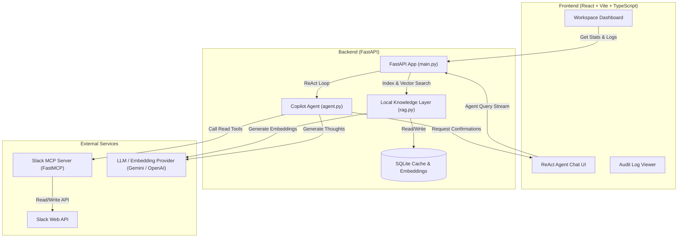

# Slack Intelligence Copilot 🚀

[](https://python.org)
[](https://nodejs.org)
[](https://vitejs.dev)
[](https://fastapi.tiangolo.com)
[](https://modelcontextprotocol.io)

An AI-driven workspace intelligence dashboard and conversational auditor for Slack. It leverages the **Model Context Protocol (MCP)** to interact securely with Slack workspace data, cache conversations locally, generate vector embeddings, enable semantic search, and execute **ReAct-style reasoning loops** to summarize channels, track decisions, and draft posts with **human-in-the-loop validation**.

---

## 🏗️ System Architecture



---

## ✨ Core Features

*   **📊 Interactive Workspace Analytics Dashboard**
    *   **Activity Volume:** Message frequency graphs tracked over time.
    *   **Workspace Sentiment:** Real-time sentiment metrics calculated from message contents.
    *   **Action Items:** Auto-extracted pending tasks, follow-ups, and assignments.
    *   **Trending Topics:** Top keywords tracked and displayed via frequency analysis.
*   **🤖 ReAct-Style AI Copilot**
    *   Streams reasoning steps (Thoughts) and tool calls in real time.
    *   Resolves natural language references (e.g., `#general` or `Teja`) into Slack IDs automatically.
    *   Uses specialized templates to generate executive-level summaries, key insights, action items, and risk analyses.
*   **🧠 Local Knowledge Layer (RAG)**
    *   Caches channels, users, messages, and threads locally using a SQLite backend to prevent API rate-limiting.
    *   Generates 1D vector embeddings using Google Gemini (`text-embedding-004`) or OpenAI (`text-embedding-3-small`).
    *   Features high-performance **semantic search** using cosine similarity, with an automatic SQL keyword search fallback.
*   **🛡️ Secure Human-in-the-Loop Protocol**
    *   **Write Confirmations:** The agent intercepts writing actions (e.g., sending messages or replying to threads) and suspends execution until verified by the user.
    *   **Audit Logging:** Tracks and logs all critical actions, background sync states, and user confirmations.

---

## 📂 Project Structure

```
├── backend/                  # FastAPI & Python backend
│   ├── agent.py              # ReAct Agent loop logic (Gemini/OpenAI/Ollama)
│   ├── config.py             # Configuration & Environment Settings
│   ├── dashboard.py          # Metrics & Analytics Compilation
│   ├── main.py               # FastAPI server entry point and CORS setup
│   ├── mcp_client.py         # Client managing connections to the MCP Server
│   ├── rag.py                # Database indexing, caching & vector search (RAG)
│   ├── slack_mcp_server.py   # Slack MCP server (FastMCP) serving slack tools
│   ├── requirements.txt      # Python dependencies
│   └── .env.example          # Template for backend secrets
│
├── frontend/                 # React, TypeScript, and Vite frontend
│   ├── src/                  # React dashboard & chat components
│   │   ├── components/       # ChatArea, Sidebar, Dashboard, Settings, AuditLogs
│   │   ├── App.tsx           # Application routing and state management
│   │   └── main.tsx          # Frontend entrypoint
│   ├── package.json          # Frontend npm dependencies
│   ├── vite.config.ts        # Vite build tool setup
│   └── .env.example          # Template for frontend environment variables
```

---

## ⚙️ Prerequisites

*   **Python 3.10+** (for Backend)
*   **Node.js 18+** & **npm** (for Frontend)
*   A **Slack Bot Token** (`xoxb-...`) with the following scopes:
    *   `channels:read`, `groups:read`, `channels:history`, `groups:history`, `users:read`, `chat:write`
*   A **Gemini API Key** (default) or **OpenAI API Key** (for LLM reasoning & vector embeddings).

---

## 🚀 Local Development Setup

### 1. Backend Setup

1.  **Navigate to the `backend/` directory**:
    ```bash
    cd backend
    ```

2.  **Create and activate a Python Virtual Environment**:
    *   **Windows (PowerShell)**:
        ```powershell
        python -m venv venv
        .\venv\Scripts\activate
        ```
    *   **macOS/Linux**:
        ```bash
        python -m venv venv
        source venv/bin/activate
        ```

3.  **Install dependencies**:
    ```bash
    pip install -r requirements.txt
    ```

4.  **Configure Environment Variables**:
    Copy the template and fill in your keys:
    ```bash
    cp .env.example .env
    ```
    *Open `.env` and configure `SLACK_BOT_TOKEN`, `GEMINI_API_KEY` (or `OPENAI_API_KEY`).*

5.  **Run the Server**:
    ```bash
    python main.py
    ```
    *   The server runs on **`http://127.0.0.1:8000`**.
    *   The backend initializes a local SQLite database (`slack_copilot.db`).

---

### 2. Frontend Setup

1.  **Navigate to the `frontend/` directory**:
    ```bash
    cd ../frontend
    ```

2.  **Install Node Modules**:
    ```bash
    npm install
    ```

3.  **Set up Environment Variables**:
    Create a `.env` file pointing to your backend:
    ```bash
    cp .env.example .env
    ```
    *(By default, `VITE_API_BASE` is configured to point to `http://localhost:8000/api/v1`)*

4.  **Start the Vite Development Server**:
    ```bash
    npm run dev
    ```
    *   Open **`http://localhost:5173`** in your browser to start using the dashboard!

---

## ☁️ Deployment Guidelines

Since the project is built as decoupled services, you can host them independently on platforms optimized for their respective tech stacks.

### Backend Deployment (e.g., Render, Railway, Fly.io)

1.  **Deploy Python Web Service**:
    *   Set the root directory to `backend/`.
    *   **Build Command**: `pip install -r requirements.txt`
    *   **Start Command**: `uvicorn main:app --host 0.0.0.0 --port $PORT`
2.  **Environment Variables**:
    *   Define `SLACK_BOT_TOKEN`, `GEMINI_API_KEY`, and `LLM_PROVIDER` in your hosting provider's configuration.
3.  **Persistent Storage (Important)**:
    *   Since SQLite stores the cached chats and audit logs locally (`slack_copilot.db`), configure a small **Persistent Disk** (e.g., 1GB mounted at `/app/data/`) and update your database path in environment variables to prevent data loss on server restarts.

### Frontend Deployment (e.g., Vercel, Netlify, Cloudflare Pages)

1.  **Deploy static Vite App**:
    *   Set the Root Directory to `frontend/`.
    *   **Build Command**: `npm run build`
    *   **Output Directory**: `dist`
2.  **Environment Variables**:
    *   Set `VITE_API_BASE` to the public URL of your hosted backend (e.g., `https://your-backend-api.com/api/v1`).

---

## 🔒 Security & Compliance

*   **Write Confirmations**: No write actions (sending messages, updating threads) will ever execute without manual click-to-approve confirmation in the UI.
*   **Secure Audit Trail**: An immutable logs ledger keeps track of all user settings changes, synchronization starts/ends, and confirmation requests.
*   **API Key Protection**: API keys can be passed as environment variables or safely cached using settings table rows inside your local database. Keys are never logged or exposed.
